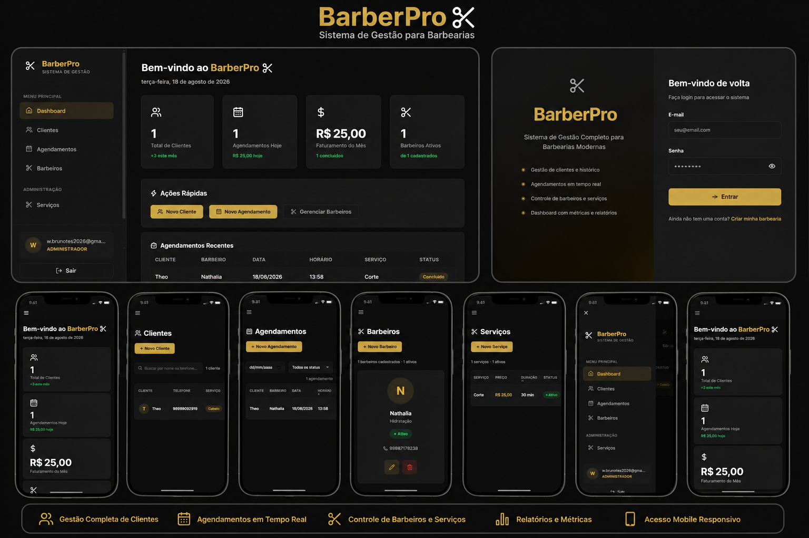
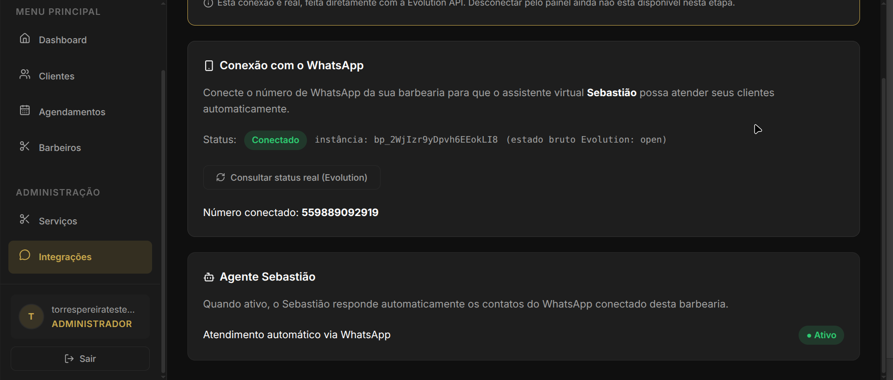

# BarberPro

> Sistema de gestão SaaS para barbearias modernas — controle completo de
> agendamentos, clientes, barbeiros e faturamento em uma única plataforma.

---

## O problema que o BarberPro resolve

Barbearias que ainda dependem de cadernos, planilhas ou aplicativos genéricos
perdem tempo com processos manuais, não têm visibilidade do faturamento em
tempo real e não conseguem organizar clientes e serviços de forma centralizada.

O BarberPro centraliza toda a operação da barbearia em um sistema web
profissional, acessível de qualquer dispositivo, com dados isolados por empresa
e controle total pelo proprietário.

---

## Funcionalidades

### Gestão de Agendamentos
- Criação, edição e exclusão de agendamentos
- Filtro por data e status (pendente, confirmado, concluído, cancelado)
- Seleção de serviço a partir do catálogo cadastrado
- Valor cobrado gravado no momento do agendamento (snapshot de preço)

### Gestão de Clientes
- Cadastro completo com nome, telefone, serviço preferido e observações
- Busca por nome ou telefone

### Gestão de Barbeiros
- Cadastro com nome, especialidade, telefone e foto
- Ativação e desativação direta na interface
- Visualização em cards com avatar e status

### Catálogo de Serviços *(exclusivo para administradores)*
- Cadastro de serviços com nome, preço e duração
- Ativação e desativação por serviço

### Dashboard
- Total de clientes cadastrados
- Quantidade de agendamentos do dia
- Faturamento do dia (soma de agendamentos concluídos no dia atual)
- Faturamento do mês (soma de agendamentos concluídos no mês atual)
- Barbeiros ativos
- Lista dos agendamentos mais recentes

### Autenticação e Controle de Acesso
- Login e cadastro com e-mail e senha (Firebase Authentication)
- Controle de acesso por perfil: `admin` e `staff`
- Rotas protegidas por autenticação e por perfil
- Páginas administrativas (Serviços, Migração de Dados) acessíveis apenas pelo administrador

> **Nota:** A arquitetura suporta múltiplos perfis de acesso (`admin` e `staff`),
> mas o fluxo de convite e criação de colaboradores ainda não está implementado.
> Atualmente, cada empresa opera com um único usuário administrador.

### Arquitetura Multi-tenant
- Cada barbearia opera em um ambiente completamente isolado
- Dados separados no Firestore por `empresaId`
- Planos com limites funcionais independentes (`starter`, `profissional`)
- Assinatura desacoplada da empresa, preparada para integração com gateway de pagamento

### Integração com WhatsApp e Agente Sebastião
- Conexão do WhatsApp da barbearia através da Evolution API
- Geração de QR Code para vinculação do número
- Instância Evolution individual por empresa
- Consulta do status real da conexão
- Identificação do número WhatsApp conectado
- Agente virtual Sebastião para atendimento automático
- Consulta de serviços, barbeiros e disponibilidade
- Criação de agendamentos diretamente pelo atendimento no WhatsApp
- Arquitetura preparada para múltiplas barbearias com isolamento por empresa

---

## Tecnologias

| Camada | Tecnologia |
|---|---|
| Interface | React 18 |
| Build | Vite 5 |
| Roteamento | React Router DOM 6 |
| Autenticação | Firebase Authentication |
| Banco de dados | Firebase Firestore |
| Ícones | lucide-react |
| Estilização | CSS puro com variáveis customizadas |
| Tipografia | Inter (Google Fonts) |
| Deploy | Vercel |
| Automação | n8n |
| WhatsApp | Evolution API |
| IA / Agente | Agente Sebastião integrado ao fluxo n8n |
| Backend de integração | Node.js / Express |

---

## Arquitetura SaaS Multi-tenant

O BarberPro utiliza **subcoleções por empresa** no Firestore para garantir
isolamento total de dados entre diferentes barbearias.

```
Firestore
├── empresas/{empresaId}
│   ├── clientes/{id}
│   ├── barbeiros/{id}
│   ├── agendamentos/{id}
│   └── servicos/{id}
├── assinaturas/{empresaId}
└── users/{uid}
```

Cada usuário autenticado é associado a uma empresa via `users/{uid}.empresaId`.
Todas as operações de leitura e gravação são realizadas exclusivamente dentro
do escopo dessa empresa.

A criação de empresa é uma operação **atômica** (`writeBatch`): empresa,
assinatura e usuário administrador são criados juntos ou não são criados.

Além dos dados operacionais isolados por `empresaId`, cada empresa pode possuir
sua própria instância da Evolution API. O vínculo entre empresa e instância
permite que o atendimento via WhatsApp consulte serviços, barbeiros,
disponibilidade e agendamentos dentro do escopo correto da barbearia.

---

## Controle de Acesso

| Perfil | Acesso |
|---|---|
| `admin` | Acesso completo, incluindo Serviços e Migração de Dados |
| `staff` | Acesso às rotas operacionais (Dashboard, Clientes, Barbeiros, Agendamentos) |

O controle é aplicado em duas camadas: nas guards de rota (`AdminRoute`) e
dentro dos próprios componentes administrativos.

---

## Screenshots

<p align="center">
  
</p>

<p align="center">
  Dashboard, autenticação e experiência responsiva do BarberPro em desktop e dispositivos móveis.
</p>

<p align="center">
  
</p>

<p align="center">
  Integração com WhatsApp e Agente Sebastião — status da conexão, instância Evolution vinculada à empresa, número conectado e status do atendimento automático.
</p>

---

## Estrutura de Pastas

```
src/
├── components/        # Componentes reutilizáveis (Modal, Sidebar, Toast, etc.)
├── config/            # Configuração de planos e preços
├── contexts/          # EmpresaContext — autenticação, empresa e role unificados
├── firebase/          # Inicialização do Firebase
├── hooks/             # Hooks de dados (useClientes, useAgendamentos, etc.)
├── pages/             # Páginas da aplicação
├── services/          # Camada de acesso ao Firestore
├── styles/            # CSS global com variáveis
└── utils/             # Utilitários (migração de dados)
```

---

## Interface Responsiva

O BarberPro possui interface responsiva e funciona em dispositivos móveis.

| Tela | Comportamento |
|---|---|
| Desktop (> 1024px) | Sidebar fixa à esquerda |
| Tablet (≤ 1024px) | Sidebar recolhida com overlay |
| Mobile (≤ 768px) | Menu hambúrguer, tabelas com scroll horizontal |
| Mobile pequeno (≤ 480px) | Layout compacto adaptado |

---

## Executando localmente

### Pré-requisitos

- Node.js 18 ou superior
- npm
- Conta no [Firebase](https://firebase.google.com) com um projeto criado
- **Firebase Authentication** habilitado com o provedor **E-mail/senha**
- **Firebase Firestore** habilitado

### 1. Clonar o repositório

```bash
git clone https://github.com/brunotorrespereira/barberpro.git
cd barberpro
```

### 2. Instalar dependências

```bash
npm install
```

### 3. Configurar variáveis de ambiente

Copie o arquivo de exemplo e preencha com as credenciais do seu projeto Firebase:

```bash
cp .env.example .env
```

Abra o arquivo `.env` e preencha cada variável com os dados do seu projeto:

```env
VITE_FIREBASE_API_KEY=
VITE_FIREBASE_AUTH_DOMAIN=
VITE_FIREBASE_PROJECT_ID=
VITE_FIREBASE_STORAGE_BUCKET=
VITE_FIREBASE_MESSAGING_SENDER_ID=
VITE_FIREBASE_APP_ID=
```

> As credenciais estão disponíveis no Firebase Console em
> **Configurações do projeto → Seus aplicativos → SDK setup and configuration**.

### 4. Executar em desenvolvimento

```bash
npm run dev
```

Acesse no navegador o endereço **Local** informado pelo Vite no terminal.

### 5. Build de produção

```bash
npm run build
```

O artefato de deploy será gerado na pasta `dist/`.

---

## Deploy

O projeto está em produção na **Vercel**.

Para realizar o seu próprio deploy:

1. Importe o repositório na Vercel
2. Configure as variáveis de ambiente (as mesmas do `.env`) nas configurações do projeto
3. A Vercel detecta automaticamente o Vite e executa `npm run build`

O conteúdo da pasta `dist/` é servido como aplicação estática.

---

## Status do Projeto

🟢 **Em desenvolvimento ativo**

### Implementado

- [x] Autenticação com Firebase (login e cadastro)
- [x] Arquitetura SaaS multi-tenant com isolamento por empresa
- [x] Dashboard com métricas de faturamento em tempo real
- [x] Gestão completa de clientes
- [x] Gestão completa de barbeiros
- [x] Gestão completa de agendamentos com snapshot de preço
- [x] Catálogo de serviços com preço e duração
- [x] Proteção de rotas administrativas por perfil
- [x] Interface responsiva para desktop e mobile
- [x] Ferramenta de migração de dados
- [x] Página de Integrações
- [x] Integração com Evolution API
- [x] Conexão do WhatsApp por QR Code
- [x] Instância WhatsApp individual por empresa
- [x] Agente virtual Sebastião via n8n
- [x] Consulta de disponibilidade pelo WhatsApp
- [x] Criação de agendamento pelo atendimento automatizado

> **Nota:** a integração com WhatsApp/Evolution API e o Agente Sebastião já
> funcionam de ponta a ponta, mas o fluxo ainda está em fase de testes e
> ajustes para o cenário multi-tenant (múltiplas barbearias simultâneas).

### Roadmap

- [ ] Recuperação de senha
- [ ] Convite de colaboradores (múltiplos usuários por empresa)
- [ ] Histórico de faturamento por mês com navegação entre períodos
- [ ] Configurações da empresa (logo, endereço, horário de funcionamento, PIX)
- [ ] Integração com gateway de pagamento para assinaturas
- [ ] Relatórios exportáveis

---

## Desenvolvido por

**[brunotorrespereira](https://github.com/brunotorrespereira)**
